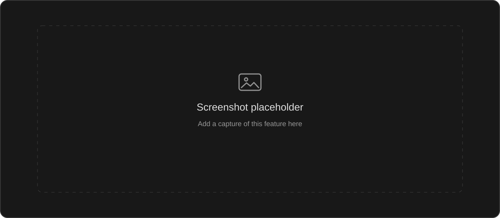

<p align="center">
  <picture>
    <source media="(prefers-color-scheme: dark)" srcset="frontend/public/void%20logo%20white.png">
    <source media="(prefers-color-scheme: light)" srcset="frontend/public/void%20logo.png">
    
  </picture>
</p>

<h1 align="center">VOID</h1>

<p align="center"><strong>Your models. Your workflow. One workspace.</strong></p>

<p align="center">
  <a href="#features">Features</a> ·
  <a href="#quick-start">Quick start</a> ·
  <a href="docs/void-capabilities.md">Tools inventory</a> ·
  <a href="docs/deployment-release.md">Deployment</a> ·
  <a href="docs/screenshots/README.md">Screenshot guide</a>
</p>

VOID brings multi-model chat, research, visual creation and a device workspace into a single AI assistant. Connect your own providers, choose which model handles each stage, and turn answers into diagrams, images, presentations and real documents.

Built with **Next.js, React, TypeScript, Express and Supabase**. The latest update brings configurable orchestration and routing, a reorganized provider panel, smarter web media, preview-first presentations and colorful Mermaid rendering.

## Features

Every feature below includes a reserved screenshot panel. To add a real capture, upload it using the named slot and replace that section's placeholder image path. See the [screenshot guide](docs/screenshots/README.md).

### Connect and control

#### Email-first sign-in and profiles

A charcoal login page with VOID branding, email and password sign-in, password reset, Google and GitHub OAuth, and phone/SMS verification. Returning users can see their remembered profile photo on the same browser; OAuth and SMS require the corresponding Supabase provider setup.

<!-- Screenshot slot: docs/screenshots/login.png -->


<sub>Screenshot slot: <code>docs/screenshots/login.png</code></sub>

#### Bring your own AI providers

Connect, test, refresh, enable or remove your own provider connections, discover their models, and choose the capabilities you use. Provider branding, masked keys and immediate switch feedback keep the panel clear; saved credentials are encrypted on the server. Supported adapters include OpenAI, Gemini, Anthropic, Groq, OpenRouter and custom OpenAI-compatible endpoints.

<!-- Screenshot slot: docs/screenshots/ai-providers.png -->


<sub>Screenshot slot: <code>docs/screenshots/ai-providers.png</code></sub>

#### Visual model orchestration

Assign connected models to researcher, analyst, fact-checker, answer-writer or custom roles. The animated workflow highlights the primary model and runs specialist stages before the final writer. One model handles every role by default; a model can take several roles, and multiple models can share a provider connection.

<!-- Screenshot slot: docs/screenshots/orchestration.png -->


<sub>Screenshot slot: <code>docs/screenshots/orchestration.png</code></sub>

#### Your fallback sequence

Choose the primary model and order the connected models that may take over when an eligible route fails. A single-model setup starts with no automatic fallback. Add more models from an existing provider or connect another key, then reorder the chain in the Routing tab.

<!-- Screenshot slot: docs/screenshots/routing.png -->


<sub>Screenshot slot: <code>docs/screenshots/routing.png</code></sub>

#### Organized, responsive settings

AI providers, orchestration and routing have dedicated tabs. Voice settings collapse beneath provider connections, with image-provider selection below them; General holds custom instructions. Minimal controls, light/dark appearance, saved workflow drafts and reduced-motion support keep configuration manageable.

<!-- Screenshot slot: docs/screenshots/settings.png -->


<sub>Screenshot slot: <code>docs/screenshots/settings.png</code></sub>

### Chat and research

#### Streaming answers and reasoning modes

Write, code, translate, summarize and reason with connected models in Auto, Fast, Deep or Manual mode. Responses support headings, lists, tables, syntax-highlighted code and mathematical notation, with progress and execution details alongside the answer.

<!-- Screenshot slot: docs/screenshots/chat.png -->


<sub>Screenshot slot: <code>docs/screenshots/chat.png</code></sub>

#### Web, news and academic research

Search the web, read public pages and follow sources with citations. Recent queries use freshness windows and source ranking; Deep mode can divide research into specialist work. If fresh evidence is unavailable, VOID reports that limitation rather than presenting background reference pages as a current update.

<!-- Screenshot slot: docs/screenshots/web-research.png -->


<sub>Screenshot slot: <code>docs/screenshots/web-research.png</code></sub>

#### Relevant web images

A semantic intent gate decides whether pictures belong in the answer, extracts a concrete subject and checks candidate imagery against the final response. Explicit photo requests and relevant visual subjects can receive verified images; conversational, assistant-identity, coding and abstract questions omit them.

<!-- Screenshot slot: docs/screenshots/web-images.png -->


<sub>Screenshot slot: <code>docs/screenshots/web-images.png</code></sub>

#### Files and document-grounded answers

Ask questions about uploaded text, code, PDFs, Word documents, PowerPoint decks, spreadsheets and images. Extraction and supported vision/OCR help ground the answer in the supplied material; available image and scanned-document understanding depends on the connected model.

<!-- Screenshot slot: docs/screenshots/attachments.png -->


<sub>Screenshot slot: <code>docs/screenshots/attachments.png</code></sub>

#### Chat history, folders and snippets

Find recent conversations, search history, pin chats, organize folders and save useful snippets. Account chat history and local workspace files remain separate, so you can navigate discussions without losing track of their outputs.

<!-- Screenshot slot: docs/screenshots/chat-history.png -->


<sub>Screenshot slot: <code>docs/screenshots/chat-history.png</code></sub>

### Create and visualize

#### Colorful flowcharts and Mermaid diagrams

Create process flows, decision branches, sequences and other supported Mermaid diagrams directly in chat or the artifact canvas. Restrained colors, multiline labels, transparent surfaces, fit-to-width, zoom, source inspection and SVG export make diagrams readable and reusable.

<!-- Screenshot slot: docs/screenshots/mermaid-flowcharts.png -->


<sub>Screenshot slot: <code>docs/screenshots/mermaid-flowcharts.png</code></sub>

#### Branch-colored mind maps

Turn a topic into a radial hierarchy with a contrasting root and distinct branch colors in light or dark mode. Mermaid and supported JSON mind maps use the same renderer, and one response can contain both a flowchart and a mind map.

<!-- Screenshot slot: docs/screenshots/mind-maps.png -->


<sub>Screenshot slot: <code>docs/screenshots/mind-maps.png</code></sub>

#### Native charts and graphs

Build numeric bar, line, area, scatter, pie and donut charts, along with the other supported native chart layouts. Numerical axes, category colors, labels and data-driven rendering keep the visualization tied to its values; node/edge graph data can also render through Mermaid.

<!-- Screenshot slot: docs/screenshots/charts.png -->


<sub>Screenshot slot: <code>docs/screenshots/charts.png</code></sub>

#### Image generation and source-image edits

Choose an image-capable model in AI Providers to generate visuals or edit a selected source image when that provider supports editing. Generation shows the model used and reports missing keys, quota failures or unsupported operations clearly.

<!-- Screenshot slot: docs/screenshots/image-generation.png -->


<sub>Screenshot slot: <code>docs/screenshots/image-generation.png</code></sub>

#### Presentation previews and editing

Requests for a PPT, presentation or slide deck open the presentation workflow and editable visual preview by default. Structured slides, varied layouts, notes and completeness checks help produce a coherent deck. An explicit preview request keeps the preview even when PowerPoint is mentioned.

<!-- Screenshot slot: docs/screenshots/presentation-preview.png -->


<sub>Screenshot slot: <code>docs/screenshots/presentation-preview.png</code></sub>

#### PowerPoint downloads

Ask explicitly for PowerPoint or PPTX without requesting a preview to create a real downloadable .pptx file. The file workflow supports slide content, speaker notes and native charts, and returns a factual title, slide count and download in chat.

<!-- Screenshot slot: docs/screenshots/powerpoint-export.png -->


<sub>Screenshot slot: <code>docs/screenshots/powerpoint-export.png</code></sub>

#### Selective presentation imagery

The presentation studio uses a connected image-generation model for planned visual slots and web references where real imagery is needed. Without an image key, suitable slots can use relevant web images. Text, diagrams and charts retain native layouts; failed generation is labeled in the image slot and can be retried.

<!-- Screenshot slot: docs/screenshots/presentation-images.png -->


<sub>Screenshot slot: <code>docs/screenshots/presentation-images.png</code></sub>

#### Posters, infographics and visual editing

Generate structured posters and infographics with editable layouts and supporting visuals. The visual studio preserves topic context for follow-up edits and uses the configured image pipeline for generation or compositing.

<!-- Screenshot slot: docs/screenshots/visual-studio.png -->


<sub>Screenshot slot: <code>docs/screenshots/visual-studio.png</code></sub>

#### Word documents and reports

Create actual DOCX files with styled headings, paragraphs, lists, tables and supported embedded images. Structured reports also have a visual document editor with Word and PDF export.

<!-- Screenshot slot: docs/screenshots/word-documents.png -->


<sub>Screenshot slot: <code>docs/screenshots/word-documents.png</code></sub>

#### Excel spreadsheets

Create actual XLSX workbooks with multiple sheets, styled headers, typed cells, formulas, cached numeric results and supported native charts. Requested spreadsheets return a device download directly in the conversation.

<!-- Screenshot slot: docs/screenshots/spreadsheets.png -->


<sub>Screenshot slot: <code>docs/screenshots/spreadsheets.png</code></sub>

#### PDF reports and forms

Create paginated PDFs with headings, paragraphs, tables and supported text form fields. Requested document downloads use real format generators and remain available in the account/browser that created them.

<!-- Screenshot slot: docs/screenshots/pdf-reports.png -->


<sub>Screenshot slot: <code>docs/screenshots/pdf-reports.png</code></sub>

#### Websites and code artifacts

Generate responsive HTML, CSS and JavaScript artifacts, inspect them in an isolated preview, edit their source and download the result. Artifact generation produces a local preview; publishing a website is a separate deployment step.

<!-- Screenshot slot: docs/screenshots/web-artifacts.png -->


<sub>Screenshot slot: <code>docs/screenshots/web-artifacts.png</code></sub>

### Voice and device workspace

#### Configurable voice conversations

Select a native realtime connection or a modular pipeline with separate conversation, speech-to-text and text-to-speech models. Stream spoken replies and use automatic language handling, including Hindi and Hinglish where supported by the selected services.

<!-- Screenshot slot: docs/screenshots/voice-agent.png -->


<sub>Screenshot slot: <code>docs/screenshots/voice-agent.png</code></sub>

#### Python and JavaScript workspace

Run Python or JavaScript in an isolated, disposable browser runtime from the sidebar Workspace. Results appear in the Code panel with bounded execution; the sandbox uses standard libraries and does not grant access to the host filesystem.

<!-- Screenshot slot: docs/screenshots/code-workspace.png -->


<sub>Screenshot slot: <code>docs/screenshots/code-workspace.png</code></sub>

#### Local files and direct downloads

Read a file you select, create text/code/CSV files, and inspect generated downloads in the Files panel. Office and PDF generation can run directly from chat without opening Workspace; important local downloads can be saved to your device.

<!-- Screenshot slot: docs/screenshots/workspace-files.png -->


<sub>Screenshot slot: <code>docs/screenshots/workspace-files.png</code></sub>

#### Device memory and conversation recall

Store, retrieve, audit and delete account-scoped memories on this device, with approval for memory changes. Local workspace memory stays in the browser; session conversation search can recall messages from a known active agent session.

<!-- Screenshot slot: docs/screenshots/memory.png -->


<sub>Screenshot slot: <code>docs/screenshots/memory.png</code></sub>

#### Usage, cost estimates and model inspection

Inspect model-level token records, enter your own input/output rates and view estimated conversation costs. VOID distinguishes provider-reported counts from estimates, leaves cost unknown when rates are missing, and lets you inspect connected capabilities or approve a model override for the next turn.

<!-- Screenshot slot: docs/screenshots/usage.png -->


<sub>Screenshot slot: <code>docs/screenshots/usage.png</code></sub>

#### Calculations and external lookups

Use the registered calculator, weather, exchange-rate, stock-quote and place/address lookup tools when the task needs them. These complement research and reasoning; external lookups depend on their configured services and availability.

<!-- Screenshot slot: docs/screenshots/lookup-tools.png -->


<sub>Screenshot slot: <code>docs/screenshots/lookup-tools.png</code></sub>

#### Tool execution and permission controls

VOID registers 29 function tools, validates their arguments, supports native and compatible text-form tool calls, and reuses completed reads. Device results are tied to their authenticated owner; sensitive workspace actions retain approval, and execution traces show the work behind the answer.

<!-- Screenshot slot: docs/screenshots/tool-execution.png -->


<sub>Screenshot slot: <code>docs/screenshots/tool-execution.png</code></sub>

## Quick start

Use **Node.js 24.13+ (24.x)** and **npm 11.x**. From the repository root:

```sh
npm ci
cp .env.example .env
cp frontend/.env.example frontend/.env.local
npm run dev
```

On PowerShell, use `Copy-Item` in place of `cp`. The frontend runs at `http://localhost:3000`; the supervised agent backend uses loopback port `3001`.

Before signing in:

1. Configure the Supabase project URL and anon key using the environment templates. Enable the OAuth/SMS providers you want and add your local or deployed authentication redirect URLs.
2. Apply the supplied application, BYOK, provider-orchestration and voice migrations in filename order, with the required storage policies. Follow the [setup and deployment guide](docs/deployment-release.md).
3. Set `SUPABASE_SERVICE_ROLE_KEY` on the Next.js server, and use the same 64-character hexadecimal `ENCRYPTION_KEY` and random `VOID_INTERNAL_KEY` on Next.js and Express. These values stay server-only.
4. Sign in, open **Settings → AI Providers**, connect your keys, and choose a primary model. Add optional roles in **Orchestration** and fallbacks in **Routing**.
5. Configure `TAVILY_API_KEY` for web search and image retrieval. Voice and image creation use their connected providers; configure only the services you intend to use.

Generate a server secret with:

```sh
node -e "console.log(require('crypto').randomBytes(32).toString('hex'))"
```

Generate separate values for encryption and internal access. Production also requires the private deployment username/password settings described in the deployment guide. The environment examples list supported integrations; real `.env` files remain outside Git.

## Commands

| Command | Purpose |
| --- | --- |
| `npm run dev` | Start the frontend and supervised backend |
| `npm run build` | Build Next.js and compile the agent server |
| `npm test` | Run backend unit and integration tests |
| `npm run test:frontend` | Run frontend auth, provider, routing, chat, media, diagram and workspace tests |
| `npm run test:database` | Verify migrations and database access boundaries with PGlite |
| `npm run test:production` | Smoke-test the built app and production security |
| `npm run check:repository` | Check tracked/staged files for common secrets and generated data |
| `npm start` | Start the built frontend and backend together |
| `npm run start:frontend` | Start only the built Next.js service |
| `npm run start:backend` | Start only the built agent server |

## Repository layout

| Directory | Role |
| --- | --- |
| `frontend/` | Next.js interface, API routes and browser workspace |
| `backend/server/` | Express agent engine, tools, providers and tests |
| `backend/supabase/` | Application schema, storage and provider migrations |
| `shared/` | Shared types and contracts for routing, diagrams, files and tools |
| `scripts/` | Supervision, runtime preparation and verification |
| `docs/` | Architecture, deployment, capabilities, notices and screenshot slots |
| `desktop-agent/` | Optional standalone Windows Python voice assistant |
| `workers/` | Optional image-worker source |

The active npm workspaces are `frontend`, `backend/server` and `shared`. The legacy dashboard, duplicate FreeLLMAPI checkout and alternate UI scaffold are retired; the application no longer initializes a shared SQLite key pool.

## Deployment and verification

See the [release deployment guide](docs/deployment-release.md) for Docker, persistent Node hosting, HTTPS, Supabase, credentials and storage. The supervisor honors the frontend `PORT`, keeps `BACKEND_PORT` internal and supervises backend restarts.

The current release is designed for a **trusted private instance**. Provider access, quotas, charges, languages and supported operations depend on the accounts you configure. Workspace files, memories and usage records remain local to the creating browser/account; Supabase chat history is separate. Download important local outputs.

Recent verification includes **186 frontend tests**, **594 backend tests**, production builds, database migration/access tests, a production smoke test and repository credential checks. GitHub Actions also checks the deployment image. See [verification notes](docs/verification.md) and the [architecture guide](docs/byok-architecture.md).

## Documentation

- [Complete capabilities and 29-tool inventory](docs/void-capabilities.md)
- [Provider, orchestration and storage architecture](docs/byok-architecture.md)
- [Deployment overview](docs/deployment.md)
- [Release setup and deployment](docs/deployment-release.md)
- [Screenshot upload guide](docs/screenshots/README.md)
- [Verification notes](docs/verification.md)

## Attribution

The agent server and shared components include code derived from FreeLLMAPI. Its MIT notice is preserved in [THIRD_PARTY_NOTICES.md](THIRD_PARTY_NOTICES.md). Bundled runtime license notices are in [docs/licenses](docs/licenses). No additional license is granted here for VOID-specific code.
